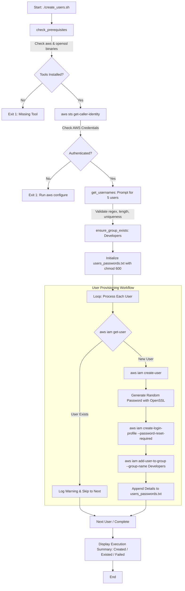

# AWS IAM User Automation

A secure, idempotent Bash automation script for provisioning IAM users, generating cryptographically randomized temporary passwords with forced reset on first sign-in, creating user groups, and enforcing credential storage hygiene via AWS CLI.

---

## Overview

Managing AWS Identity and Access Management (IAM) entities manually through the AWS Management Console can be repetitive, error-prone, and inconsistent. This project provides an automated, terminal-driven solution using **Bash** and the **AWS CLI** to provision multiple IAM users in batch, associate them with an administrative or developer IAM group, generate complex temporary passwords, and secure the generated access credentials locally.

---

## Problem

When teams or lab environments onboard new developers, administrators often face common operational challenges:
* **Manual Bottlenecks:** Creating multiple users click-by-click in the AWS console is tedious and time-consuming.
* **Weak Password Practices:** Manual user creation often leads to reused, weak, or shared temporary passwords.
* **Inconsistent Group Assignment:** Users may miss essential group memberships or receive unintended direct policy attachments.
* **Lack of Local Credential Security:** Generated temporary passwords are often left in unencrypted notes or shell histories.

---

## Features

* **Strict Input Validation:** Enforces AWS IAM username constraints (alphanumeric and `+=,.@-`, max 64 characters), blocks empty input, and checks for duplicates during the input loop.
* **Idempotent Operations:** Detects whether target IAM groups and IAM users already exist before attempting creation, preventing script crashes and AWS API errors.
* **Cryptographic Password Generation:** Generates pseudo-random passwords using `openssl rand` that meet AWS IAM complexity criteria (uppercase, lowercase, numbers, and special characters).
* **Forced Password Reset:** Employs the `--password-reset-required` flag on AWS login profiles so users must change their temporary password upon their first AWS Management Console login.
* **Group-Based Access Management:** Automatically creates and assigns users to a designated IAM Group (`Developers`), aligning with the security principle of group-based policy assignment.
* **Protected Local Output:** Saves credentials to `users_passwords.txt` with restricted POSIX file permissions (`chmod 600`), readable solely by the executing user.
* **Execution Summary:** Outputs a structured report listing newly created users, skipped existing users, and any failed operations.

---

## Technologies

* **Bash:** Shell scripting with strict variable evaluation (`set -u`) and POSIX utilities (`seq`, `xargs`, `tr`, `head`).
* **AWS CLI v2:** Interacts directly with AWS IAM and STS APIs.
* **OpenSSL:** Generates cryptographically randomized base bytes for password generation.
* **AWS STS:** Validates active AWS authentication and retrieves the target AWS Account ID.
* **AWS IAM:** Provisions users, groups, login profiles, and group memberships.

---

## Architecture / Workflow



---

## Prerequisites

Before executing the script, ensure your system has the following installed:
* **Operating System:** Linux, macOS, or Windows with WSL / Git Bash.
* **AWS CLI:** Version 2.x installed and accessible in `PATH`.
* **OpenSSL:** Installed and available in `PATH`.
* **Bash Shell:** Version 4.0 or higher (supports associative arrays).

---

## AWS Requirements

* An active AWS Account.
* Configured AWS CLI credentials via `aws configure` (or environment variables `AWS_ACCESS_KEY_ID`, `AWS_SECRET_ACCESS_KEY`, `AWS_REGION`).

---

## IAM Permissions

The executing AWS identity (user or assumed role) must have permissions to manage IAM entities. Below is a least-privilege IAM policy document providing the exact permissions required by `create_users.sh`:

```json
{
  "Version": "2012-10-17",
  "Statement": [
    {
      "Sid": "CallerIdentityCheck",
      "Effect": "Allow",
      "Action": [
        "sts:GetCallerIdentity"
      ],
      "Resource": "*"
    },
    {
      "Sid": "IAMUserAndGroupManagement",
      "Effect": "Allow",
      "Action": [
        "iam:GetGroup",
        "iam:CreateGroup",
        "iam:GetUser",
        "iam:CreateUser",
        "iam:CreateLoginProfile",
        "iam:AddUserToGroup"
      ],
      "Resource": [
        "arn:aws:iam::*:user/*",
        "arn:aws:iam::*:group/Developers"
      ]
    }
  ]
}
```

---

## Installation

1. Clone the repository:
   ```bash
   git clone https://github.com/root-whoami/aws-iam-user-automation.git
   cd aws-iam-user-automation
   ```

2. Make the script executable:
   ```bash
   chmod +x create_users.sh
   ```

---

## Configuration

By default, the script sets the following parameters within `create_users.sh`:
* `TOTAL_USERS`: `5` (Number of usernames prompted in the input loop)
* `GROUP_NAME`: `Developers` (Target IAM group name)
* `CREDENTIALS_FILE`: `users_passwords.txt` (Local file path for credential storage)

You can modify these variables directly at the top of [create_users.sh](file:///c:/Users/Acer/Downloads/youtube/github/aws-iam-user-automation/create_users.sh#L4-L6) if your requirements differ.

---

## Usage

1. Verify your AWS authentication:
   ```bash
   aws sts get-caller-identity
   ```

2. Execute the automation script:
   ```bash
   ./create_users.sh
   ```

3. Follow the interactive prompts to enter the 5 usernames when requested.

---

## Example

```text
[*] Verifying prerequisites...
[+] Authenticated to AWS Account: 123456789012
======================================================
 Enter 5 IAM usernames to create
======================================================
User 1 username: demo-user-1
User 2 username: demo-user-2
User 3 username: demo-user-3
User 4 username: demo-user-4
User 5 username: demo-user-5
[*] Checking IAM Group: Developers...
[+] Group 'Developers' found.
[*] Processing user: demo-user-1
[+] Created 'demo-user-1'.
[*] Processing user: demo-user-2
[+] Created 'demo-user-2'.
[*] Processing user: demo-user-3
[+] Created 'demo-user-3'.
[*] Processing user: demo-user-4
[+] Created 'demo-user-4'.
[*] Processing user: demo-user-5
[+] Created 'demo-user-5'.

======================================================
                 EXECUTION SUMMARY                    
======================================================
Created (5):   demo-user-1 demo-user-2 demo-user-3 demo-user-4 demo-user-5
Existed (0):   None
Failed  (0):   None
======================================================
[!] Output saved: /home/user/aws-iam-user-automation/users_passwords.txt (chmod 600)
```

---

## Example Output (`users_passwords.txt`)

> [!NOTE]
> The credentials shown below are strictly sanitized placeholders for demonstration. Real credentials must never be shared or committed.

```text
# SENSITIVE IAM CREDENTIALS - DO NOT COMMIT
# Generated: Sun Sep 27 08:30:00 UTC 2026
==================================================
Username: demo-user-1
Temporary Password: EXAMPLE_ONLY_DO_NOT_USE!9Aa
Console URL: https://123456789012.signin.aws.amazon.com/console/
--------------------------------------------------
Username: demo-user-2
Temporary Password: EXAMPLE_ONLY_DO_NOT_USE!9Aa
Console URL: https://123456789012.signin.aws.amazon.com/console/
--------------------------------------------------
```

---

## Security

* **No Hardcoded Secrets:** Credentials are never hardcoded inside scripts or committed to Git.
* **Restricted File Permissions:** The credential output file is initialized with `chmod 600` so only the file owner has read and write permissions.
* **Git Safeguards:** `.gitignore` explicitly prevents `users_passwords.txt`, credential files, private keys (`*.pem`, `*.key`), and environment files (`.env`) from being tracked.
* **Mandatory Password Reset:** All console profiles require immediate credential rotation upon first login.
* **Group-Based Access:** Individual user accounts are managed through group membership rather than ad-hoc inline policies.

---

## Error Handling

* **Prerequisite Failures:** If `aws` or `openssl` is missing, the script halts with an explicit error code (`exit 1`) and installation instructions.
* **Authentication Failures:** Validates that active AWS credentials respond; halts if unconfigured.
* **Input Validation:** Reprompts immediately if an invalid username or duplicate username is entered without terminating the entire session.
* **Idempotency:** Gracefully skips existing IAM users without halting provisioning for the remaining users in the queue.
* **API Failures:** Logs AWS API errors and tracks failed users in a `failed_users` array for the final summary.

---

## Project Structure

```text
aws-iam-user-automation/
├── .gitignore
├── LICENSE
├── README.md
├── create_users.sh
└── docs/
    └── architecture.md
```

---

## Troubleshooting

1. **`AWS CLI not found`**
   * Install the AWS CLI v2: [AWS CLI Installation Guide](https://docs.aws.amazon.com/cli/latest/userguide/getting-started-install.html).

2. **`AWS credentials not configured`**
   * Run `aws configure` and supply your Access Key ID, Secret Access Key, default region, and output format.

3. **`An error occurred (AccessDenied) when calling the CreateUser operation`**
   * Ensure your configured AWS CLI IAM identity has permission to perform `iam:CreateUser`, `iam:CreateLoginProfile`, and `iam:AddUserToGroup`.

4. **`declare: -A: invalid option`**
   * Associative arrays require Bash 4.0+. On macOS, upgrade Bash via Homebrew (`brew install bash`) or run inside WSL on Windows.

---

## Cleanup

To remove the resources created by a test run of this script:

```bash
# Set variables matching your run
GROUP="Developers"
USERS=("demo-user-1" "demo-user-2" "demo-user-3" "demo-user-4" "demo-user-5")

# Remove users from group, delete login profile, and delete user
for u in "${USERS[@]}"; do
    aws iam remove-user-from-group --user-name "$u" --group-name "$GROUP" 2>/dev/null || true
    aws iam delete-login-profile --user-name "$u" 2>/dev/null || true
    aws iam delete-user --user-name "$u" 2>/dev/null || true
done

# Remove group (if empty and no longer needed)
aws iam delete-group --group-name "$GROUP" 2>/dev/null || true

# Remove local credential file
rm -f users_passwords.txt
```

---

## Future Improvements

* [ ] Add a non-interactive flag (`--file users.txt`) to ingest usernames from a CSV or line-delimited text file.
* [ ] Add a `--cleanup` flag to automate resource deletion for laboratory and sandbox testing.
* [ ] Integrate AWS Secrets Manager or KMS to store temporary passwords instead of local file output.
* [ ] Add automated pre-commit hooks to verify shell scripts with ShellCheck before committing.
