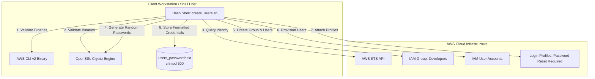

# AWS IAM User Automation: Architecture & Technical Design

This document details the architectural flow, component relationships, security boundaries, and operational considerations of the `aws-iam-user-automation` project.

---

## 1. System Architecture

The automation is designed as a single-process client orchestrator communicating with the AWS Identity and Access Management (IAM) and AWS Security Token Service (STS) APIs via the AWS CLI.

---

## 2. Component Breakdown

| Component | Responsibility | Failure Handling |
| :--- | :--- | :--- |
| **Prerequisite Validator** | Verifies existence of `aws` and `openssl` binaries and validates active AWS credentials. | Halts execution immediately (`exit 1`) with descriptive remediation advice. |
| **Input Ingestion & Sanitizer** | Gathers 5 unique usernames via interactive prompt; checks against character whitelist `^[a-zA-Z0-9+=,.@-]{1,64}$`. | Loops until valid input is received; rejects duplicates within the session. |
| **Group Controller** | Verifies existence of the target IAM group (`Developers`) or creates it. | Halts execution if group creation fails due to unauthorized permissions. |
| **Password Synthesizer** | Calls `openssl rand -base64 12`, filters alphanumeric characters, and appends `!9Aa` ensuring compliance with strict IAM password rules. | Generates fresh, non-deterministic strings per user. |
| **User Provisioning Engine** | Idempotently checks AWS for existing username; provisions new user, sets temporary login password with forced rotation, and attaches user to the target group. | Skips already-existing users; logs errors for API rejections while continuing loop. |
| **Secure Output Sink** | Pre-allocates `users_passwords.txt` with `chmod 600` permissions and formats credentials with the console login URI. | Git-ignored; local only. |

---

## 3. Security Boundary & Controls

1. **POSIX Permissions Boundary:**
   The output credential file is secured at creation time using `chmod 600`, preventing non-root local users on shared systems from inspecting temporary passwords.

2. **AWS API Authentication Boundary:**
   Authentication relies on the operating system environment or configured profile (`~/.aws/credentials`). No AWS access keys or tokens are stored in or accepted as arguments by the script.

3. **Lifecycle Security:**
   Passes `--password-reset-required` during console login profile creation. Even if initial temporary credentials are compromised, they are invalid after the user's first login and password change.
